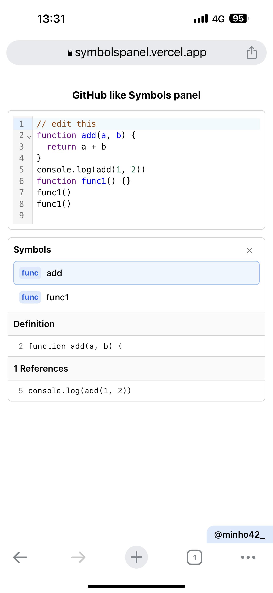

Looking at the Symbols panel on GitHub made me to want to implement (copy) my own.

https://symbolspanel.vercel.app

https://github.com/minho42/github-like-symbol-panel



```shell
❯ npx create-next-app@latest github-like-symbol-panel

# Used default settings provided by Next.js
# ? Would you like to use TypeScript? › No
# ? Would you like to use ESLint? › No
# ? Would you like to use Tailwind CSS? › Yes
# ? Would you like to use `src/` directory? › No
# ? Would you like to use App Router? (recommended) › Yes
# ? Would you like to customize the default import alias? › No

❯ cd github-like-symbol-panel
```

```shell
❯ npm i
@babel/parser
@babel/traverse
@codemirror/lang-javascript
@heroicons/react
@uiw/react-codemirror
```

```shell
❯ touch app/Editor.js
❯ touch app/SymbolPanel.js
❯ tree app
app
├── Editor.js
├── SymbolPanel.js
├── globals.css
├── layout.js
└── page.js
```

```js
// layout.js
import "./globals.css"

export default function RootLayout({ children }) {
  return (
    <html lang="en">
      <body>{children}</body>
    </html>
  )
}
```

```js
//  page.js
import Editor from "./Editor"

export default function Home() {
  return (
    <main className="flex min-h-screen flex-col items-center justify-start p-3">
      <div className="font-bold py-3">GitHub like Symbols panel</div>
      <Editor />
      <a href="https://twitter.com/minho42_" target="_blank" rel="nofollow me">
        <div className="fixed right-0 bottom-0 text-black bg-blue-100 font-semibold  no-underline text-sm px-3 py-1 rounded-tl-xl">
          @minho42_
        </div>
      </a>
    </main>
  )
}
```

```css
/* globals.css */
@tailwind base;
@tailwind components;
@tailwind utilities;

body {
  font-family: -apple-system, BlinkMacSystemFont, "Segoe UI", "Noto Sans", Helvetica, Arial, sans-serif,
    "Apple Color Emoji", "Segoe UI Emoji";
  -webkit-font-smoothing: antialiased;
  -moz-osx-font-smoothing: grayscale;
}
```

```js
// Editor.js
"use client"

import CodeMirror from "@uiw/react-codemirror"
import { javascript } from "@codemirror/lang-javascript"
import SymbolPanel from "./SymbolPanel"
import { useState, useCallback } from "react"

export default function Editor() {
  const sampleCode = `// edit this
function add(a, b) {
  return a + b
}
console.log(add(1, 2))
function func1() {}
func1()
func1()
  `

  const [sourceCode, setSourceCode] = useState(sampleCode)

  const handleChange = useCallback((value, viewUpdate) => {
    setSourceCode(value)
  }, [])

  return (
    <div className="flex flex-col sm:flex-row w-full gap-3">
      <CodeMirror
        className="rounded-md border border-neutral-300 p-2 sm:w-3/4"
        value={sampleCode}
        width="100%"
        extensions={[javascript({ jsx: true })]}
        onChange={handleChange}
      />
      <SymbolPanel sourceCode={sourceCode} />
    </div>
  )
}
```

```js
// SymbolPanel.js
import { parse } from "@babel/parser"
import traverse from "@babel/traverse"
import { useState, useEffect } from "react"
import { XMarkIcon } from "@heroicons/react/24/solid"

export default function SymbolPanel({ sourceCode }) {
  const [nodes, setNodes] = useState([])
  const [selectedNode, setSelectedNode] = useState(null)
  const [selectedDefinition, setSelectedDefinition] = useState("")
  const [selectedReferences, setSelectedReferences] = useState([])
  const [references, setReferences] = useState([])

  const handleClickSymbol = (node) => {
    setSelectedNode(node)
  }

  const getLineContent = (lineNumber) => {
    const lines = sourceCode.split("\n")
    const index = lineNumber - 1

    if (index >= 0 && index < lines.length) {
      return lines[index]
    } else {
      return undefined
    }
  }

  const traverseSource = (sourceCode) => {
    const functionNames = []
    const functionNodes = []
    const functionReferences = []
    const ast = parse(sourceCode, {
      sourceType: "module",
    })

    traverse(ast, {
      FunctionDeclaration(path) {
        functionNames.push(path.node.id.name)
        functionNodes.push(path.node)
      },
      Identifier(path) {
        if (path.isReferencedIdentifier()) {
          if (functionNames.includes(path.node.name)) {
            functionReferences.push({ name: path.node.name, line: path.node.loc.start.line })
          }
        }
      },
    })

    setNodes([...functionNodes])
    setReferences([...functionReferences])
  }

  useEffect(() => {
    try {
      traverseSource(sourceCode)
    } catch (error) {}

    setSelectedDefinition(getLineContent(selectedNode?.loc.start.line))

    const tempRefs = []
    references
      .filter((ref) => ref.name === selectedNode?.id.name)
      .map((ref) => {
        tempRefs.push({ line: ref.line, content: getLineContent(ref.line) })
      })
    setSelectedReferences(tempRefs)
  }, [sourceCode, selectedNode])

  return (
    <div className="flex flex-col w-full rounded-md border border-neutral-300 text-sm ">
      <div className="px-2 py-1">
        <div className="flex w-full items-center justify-between">
          <div className="font-bold py-1 h-8">Symbols</div>
          {selectedNode ? (
            <XMarkIcon
              onClick={() => setSelectedNode(null)}
              className=" h-8 w-8 text-neutral-500 rounded-md p-2 hover:bg-neutral-100  cursor-pointer "
            />
          ) : (
            ""
          )}
        </div>
        <div className="flex flex-col">
          {nodes.map((node) => (
            <div
              onClick={() => handleClickSymbol(node)}
              className={`
              ${
                selectedNode?.id.name === node.id.name
                  ? " bg-blue-50 border-blue-300"
                  : "bg-white border-white hover:bg-blue-50"
              }
              flex rounded-md  border gap-2 p-2 cursor-pointer`}
            >
              <div
                className="flex items-center justify-center 
              bg-blue-100 text-blue-600 font-bold text-xs
              rounded-md px-1 py-0"
              >
                func
              </div>
              <div className="font-medium">{node.id.name}</div>
            </div>
          ))}
        </div>
      </div>
      {selectedNode ? (
        <section>
          <div className="px-2 py-1 bg-neutral-50 border-y border-neutral-300">
            <div className="font-semibold py-1">Definition</div>
          </div>
          <div className="px-2 py-1">
            <div className="flex items-center gap-2 px-2 py-1 font-mono text-xs">
              <div className="text-neutral-500">{selectedNode?.loc.start.line}</div>
              {selectedDefinition}
            </div>
          </div>
          <div className="px-2 py-1 bg-neutral-50 border-y border-neutral-300">
            <div className="font-semibold py-1 ">{selectedReferences.length} References</div>
          </div>
          <div className="px-2 py-1 font-mono text-xs">
            {selectedReferences.map((ref) => (
              <div className="flex items-center gap-2 px-2 py-1">
                <div className="text-neutral-500">{ref.line}</div>
                <div>{ref.content}</div>
              </div>
            ))}
          </div>
        </section>
      ) : (
        <></>
      )}
    </div>
  )
}
```

### Pet peeve

CodeMirror documentation is so scarce.

### Issues

- Editor loads very slowly
- When definition or references are selected, selected line is not highlighted in the editor view
- Arrow functions are not collected in Symbols
  - Need to use `ArrowFunctionExpression` along with `FunctionDeclaration` inside traverse()
  - Need to access function name with `path.container.id.name` rather than `path.node.id.name`
