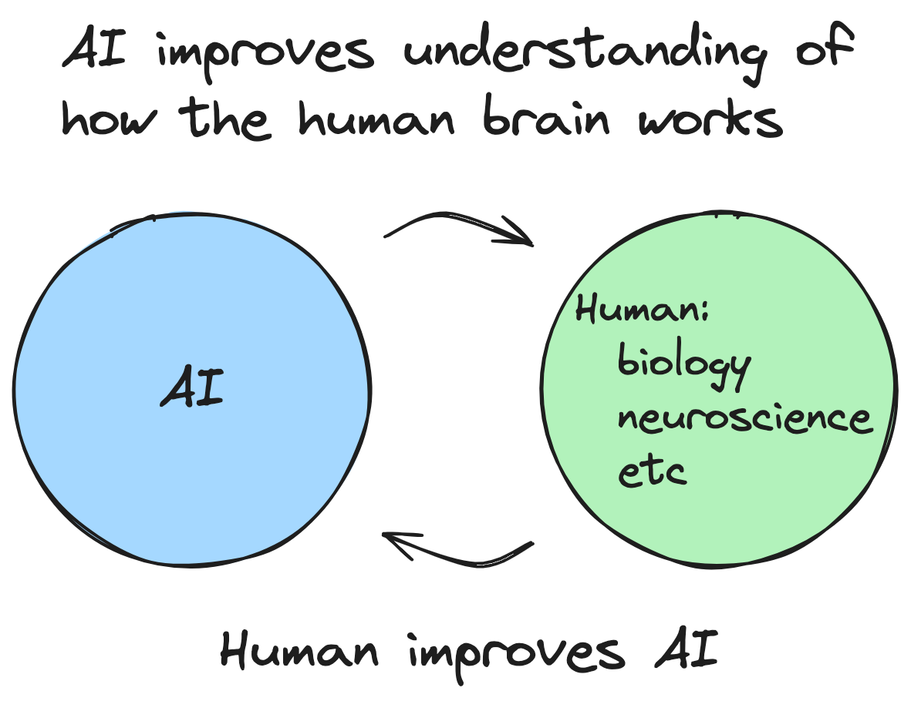

[Sora](<https://en.wikipedia.org/wiki/Sora_(text-to-video_model)>) is an unbelievable technological breakthrough, but I still doubt it’s going to be a useful component in achieving AGI.

## How I think AGI could ever be achieved, if it's possible.

#### Related

[AGI (2023)](/posts/agi)

---

<Tweet id="1662020967529435140" />

<Tweet id="1532894698439774208" />
